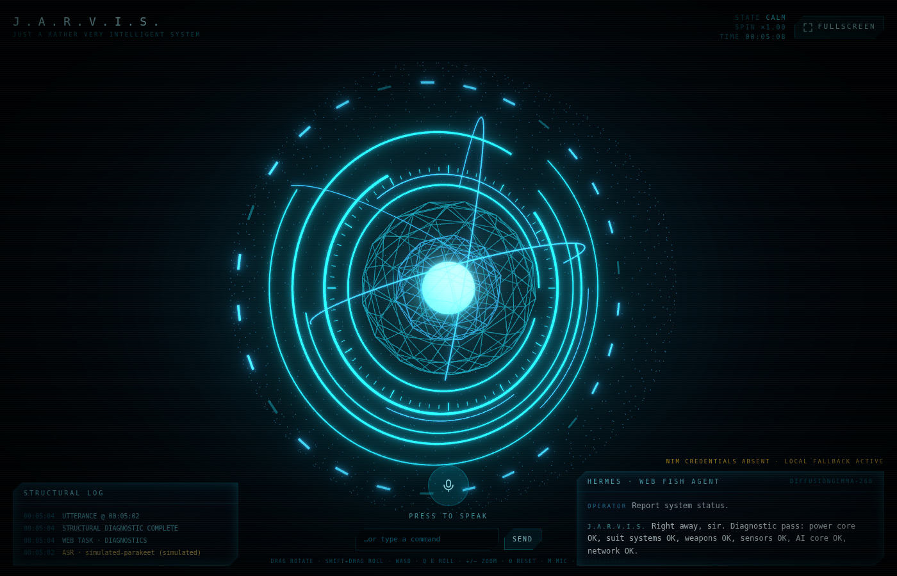

# J.A.R.V.I.S. · Mark 55

A minimal, high-fidelity Jarvis-style assistant HUD: one cinematic 3D reactor core,
voice as the default input channel, and an agent loop that drives the core itself.
Every secondary tracking panel from the classic Stark HUD (weather, network maps,
CPU meters) is deliberately absent — the core is the interface.



## Run it

```bash
npm install
npm run dev
```

Then open http://localhost:3000.

The app runs with **no credentials at all** — the ASR and LLM routes fall back to a
local simulation and the HUD flags itself as `NIM CREDENTIALS ABSENT · LOCAL FALLBACK
ACTIVE`. To go live, copy `.env.example` to `.env.local` and set `NVIDIA_API_KEY`
(plus any endpoint overrides if you run your own NIM docker node).

## What's wired up

### Interactive 3D core — `components/JarvisCore.tsx`

- An arc/ring assembly, tick ring, segment bars, wireframe lattice and a
  voice-reactive particle shell, rendered with React Three Fiber and bloomed by
  `@react-three/postprocessing`.
- **3-axis drag with momentum.** Drag rotates in world space via
  `rotateOnWorldAxis`, so yaw, pitch and roll never gimbal-lock. Pointer moves feed
  an exponential moving average of angular velocity; on release that velocity becomes
  a flick that decays with frame-rate-independent damping and glides to a stop.
  Shift-drag (or right-drag) rolls. The wheel zooms.
- Idle spin rate, ambient glow and scale are all driven by the agent.

### Voice — `lib/useVoice.ts` → `app/api/voice/transcribe/route.ts`

- `getUserMedia` + `MediaRecorder` capture; an `AnalyserNode` produces an RMS
  envelope every animation frame into a shared ref, which is what makes the core
  pulse and the particle shell breathe while you speak. It never triggers a React
  render, so the sync stays frame-accurate.
- Recording auto-stops after ~1.8 s below the silence floor.
- The recorded blob is decoded and re-encoded client-side into **16 kHz mono 16-bit
  PCM WAV** (`lib/wav.ts`) — the container `parakeet-ctc-1.1b-asr` wants — then POSTed
  to the API route, which wraps the NVIDIA bearer token server-side and normalises
  both the OpenAI-compatible and Riva-style response shapes.

### Hermes "Web Fish" agent — `lib/hermes.ts` → `app/api/agent/route.ts`

The transcript goes straight into the agent loop, which:

1. resolves intent from the utterance,
2. runs mock web-automation tasks (search, telemetry, threat sweep, diagnostics),
3. emits structured commands (`spin`, `glow`, `scale`, `log`, `web`) that the client
   replays against the 3D core and the structural log, and
4. passes the utterance plus tool observations to `google/diffusiongemma-26b-a4b-it`
   for the prose reply.

Try: *"run a full diagnostic and switch to combat mode"*, *"spin up the core"*,
*"search the web for arc reactor telemetry"*, *"stand down"*.

### Block-diffusion text reveal — `components/BlockDiffusionText.tsx`

DiffusionGemma resolves a whole canvas of blocks at once rather than streaming token
by token, so the reply is deliberately **not** typed out. Every block starts as
blurred glyph noise and snaps into focus in random order — a canvas denoising itself.
Honoured `prefers-reduced-motion` renders it instantly.

## Accessibility

- **Keyboard control of the core.** Focus the canvas and use arrows or `WASD` to
  rotate, `Q`/`E` to roll, `+`/`-` to scale, `0` to reset. Hold `Shift` for coarse
  steps. `M` toggles the mic and `F` toggles fullscreen from anywhere.
- **Semantic canvas.** The WebGL canvas carries `role="application"`,
  `aria-label="Interactive Jarvis Core Node"` and `aria-live="polite"`, with its
  bindings described in `aria-description`.
- **Live region.** A screen-reader-only `role="status"` region continuously
  summarises what the Web Fish agent did and how the core is behaving.
- **Focus rings.** Every interactive control uses
  `focus-visible:ring-2 focus-visible:ring-cyan-500`; the canvas paints its own
  matching ring on focus.
- **Text fallback.** Voice is the default channel, but any command can be typed.

## Fullscreen

The header button calls `document.documentElement.requestFullscreen()` directly to
drop the browser chrome entirely, and tracks `fullscreenchange` so its state stays
honest if the user leaves with `Esc`.

## Stack

Next.js 14 (App Router) · React 18 · Tailwind CSS · Framer Motion · Three.js via
React Three Fiber + drei + postprocessing · NVIDIA NIM (Parakeet CTC 1.1B ASR,
DiffusionGemma 26B).
